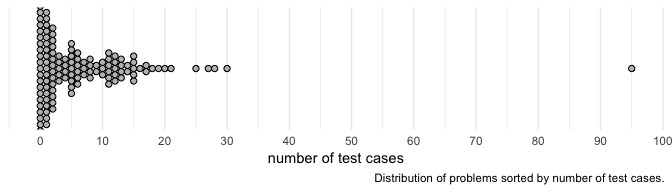
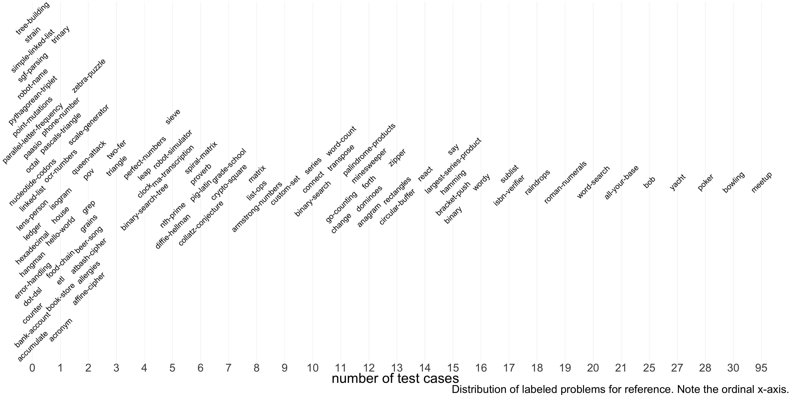
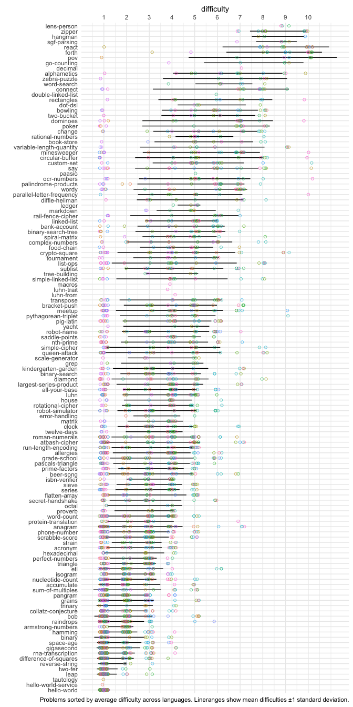
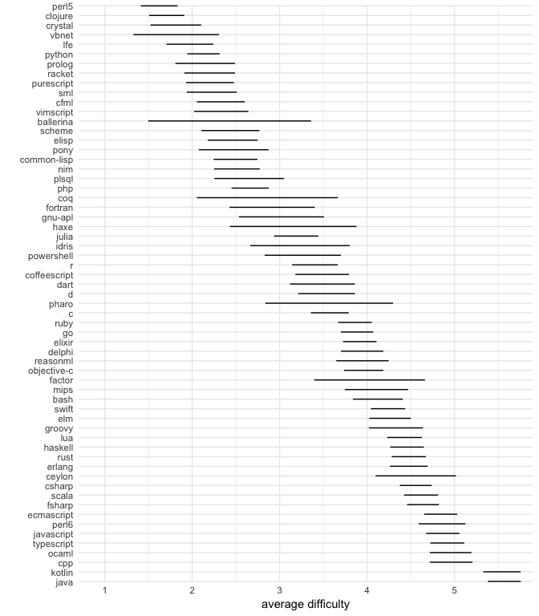
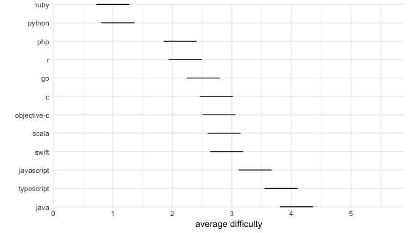
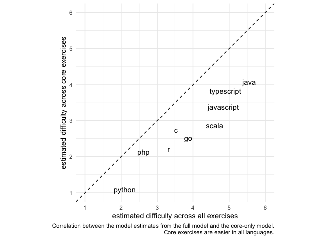

Analysis of Exercism.io problems
================

# Number of test cases

The problems or “exercises” on Exercism.io are scored via automated
tests. These tests often involve providing the solution program with
input and comparing the output to what was expected. These **test
cases** can be scored in all languages. Each problem has a different
number of test cases, and the distribution of problem sizes is shown
below. The existence of problems with zero test cases could mean that
the problem is still being developed. But most problems have more tests
than test cases, because many problems specify certain behavioral
requirements (e.g., returning an object of a particular type) that must
be manually translated into tests in each language.

**Core exercises** are implemented in all 10 most popular languages
according to
StackOverflow.

<!-- -->

<!-- -->

# Difficulty of the same problems in different languages

Most Exercism.io problems have been assigned a difficulty score ranging
from 1-10. For example, [python’s “hello-world” problem is assigned a
difficulty of
1](https://github.com/exercism/python/blob/master/config.json#L15). I
don’t know how these difficulty scores are assigned. It’s likely they
are self-assigned by the developers working on Exercism.io, and used in
the ordering of problems for particular learning tracks. What’s
interesting about these scores is that the same problems are assigned
different difficulty scores in different languages. Note the variability
within each problem in the plot below.

<!-- -->

# Average difficulty across languages

Are all Exercism.io problems easier in some languages than others? To
test this, we can estimate the average difficulty across all problems
for each language while controlling for problem using a hierarchical
linear model.

``` r
# Fit lmer mod with one param per language
lang_difficulty_mod <- lme4::lmer(difficulty ~ -1 + language + (1|exercise),
                                  data = exercises)
```

<!-- -->

## Core exercises

How do the top 10 most popular languages compare in self-assigned
difficulty on the core exercises?

<!-- -->

Are the core exercises really so easy in ruby and python compared to
java and typescript? One potential confound is that the core exercises
might simply be easier overall, in which case we might conclude that
ruby and python are good for easy problems. One way to show how
difficulty on the core problems correlates with overall difficulty is to
compare the model estimates from the full model to the core-only
model.

<!-- -->
