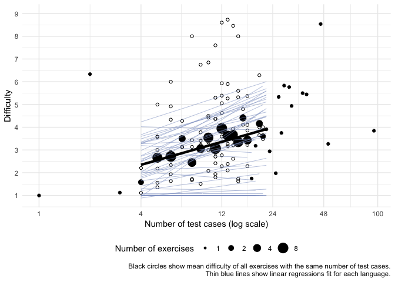

Solving the same problems in different programming languages
================

Are the same problems easier to solve in some programming languages than
others? To answer this question, we analyzed the difficulty of the same
programming problems solved in different languages available on the
website Exercism.io.

## What is Exercism.io?

[Exercism.io](https://exercism.io) is for users to learn new programming
languages and improve their programming ability by completing practice
problems referred to as “exercises”. To complete each exercise, users
have to write a program that meets certain requirements as described in
the problem specification and evaluated by automated tests. On
Exercism.io, the same problems can be solved in different languages,
making data about solutions to Exercism.io problems valuable for
understanding the potential differences between languages.

## Self-assigned problem difficulty

Most Exercism.io problems have been assigned a difficulty score ranging
from 1-10. For example, [python’s “hello-world”
problem](https://github.com/exercism/python/blob/master/config.json#L15)
is assigned a difficulty of 1.

> I don’t know how these difficulty scores are assigned. I will assume
> they are self-assigned by the developers working on Exercism.io, used
> in the ordering of problems for particular learning tracks, and are at
> least somewhat correlated with behavioral measures of difficulty.

What’s interesting about these difficulty scores is that the same
problems are assigned different difficulty scores in different
languages. Note the variability within each problem (row) in the plot
below.

<!-- -->

## Difficulty per language

**Are problems easier in some languages than others?** We can estimate
the average difficulty for each language while controlling for overall
problem difficulty using a hierarchical linear model.

``` r
# Fit lmer mod with one param per language
lang_difficulty_mod <- lme4::lmer(difficulty ~ -1 + language + (1|exercise),
                                  data = exercises)
```

<!-- -->

Not every exercise is implemented in every language. **Core exercises**
are implemented in all 10 most popular languages according to
StackOverflow. How do these top languages compare in self-assigned
difficulty on the core exercises?

<!-- -->

## Number of test cases and self-assigned difficulty

Another factor to incorporate into our model is the number of **test
cases**. Test cases involve providing the solution program with input
and comparing the output to what was expected. The same test cases can
be evaluated in all languages. Each problem has a different number of
test cases, and the distribution of problem sizes is shown below.

> Problems with zero test cases likely means the problem is still being
> developed.

In addition, most problems have more tests than test cases, because many
problems specify certain behavioral requirements (e.g., returning an
object of a particular type) that must be manually translated into tests
in each language, and do not correspond to input and output
pairs.

<!-- -->

**What’s the relationship between number of test cases and difficulty?**
Presumably problems with more test cases would be harder, and yet not
every test is the same level of
difficulty.

<!-- -->

Looking at the plot above, there seems to be a difference in difficulty
between problems with 1 and 2 tests, with some form of linear
relationship beginning with 3 tests and continuing through arounmd 30
tests. We can investigate these relationships with post-hoc tests, as
visible in the plot
below.

<!-- -->
