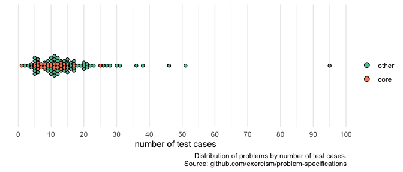

Analysis of Exercism.io problems
================

# Number of test cases

<!-- -->

<!-- -->

# Difficulty of the same problems in different languages

Most Exercism.io problems have been assigned a difficulty score ranging
from 1-10. For example, [python’s “hello-world” problem is assigned a
difficulty of
1](https://github.com/exercism/python/blob/master/config.json#L15). I
don’t know how these difficulty scores are assigned. It’s likely they
are self-assigned by the developers working on Exercism.io, and used in
the ordering of problems for particular learning tracks. What’s
interesting about these scores is that the same problems are assigned
different difficulty scores in different languages. Note the variability
within each problem in the plot below.

<!-- -->

# Average difficulty across languages

Are all Exercism.io problems easier in some languages than others? To
test this, we can estimate the average difficulty across all problems
for each language while controlling for problem using a hierarchical
linear model.

``` r
# Fit lmer mod with one param per language
lang_difficulty_mod <- lme4::lmer(difficulty ~ -1 + language + (1|exercise),
                                  data = exercises)
```

<!-- -->
